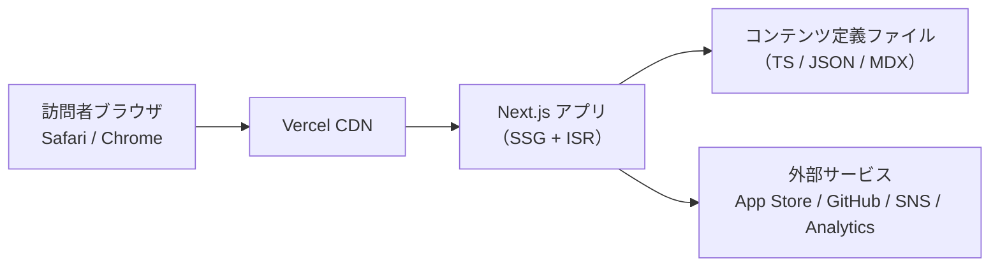

# Specification (single-file)

> 本ファイルはプロジェクトの全仕様を1ファイルで管理します。

## 目次

## 1. 概要

## 2. UI/UX

- Work セクションのフォルダカード：カバーをクリックすると開閉し、開時はカードを扇状に展開。カードまたはドットをクリックすると任意のカードをフォーカスして中央にスライドさせ、背面カードも前面で閲覧可能。フォーカス外カードはスケール/不透明度を下げて重なりを解消し、z-index はインデックス計算で決定的に固定（ホバー依存なし）。端のフォルダは `edgeAnchorOffset` で内側に展開させて画面外溢れを防止。
- ドット列のスクラブ操作：ドット上をドラッグ/ホバー移動すると位置に応じて順次カードを切り替え、フォーカス中カードが前面にスライドする。クリック操作は従来どおり有効。スクラブはコンテナ全体で位置を検出し、インデックスを計算する決定的な方式で z-index を変えない。
- カード選択の段階挙動：開いている状態で非最前面のカードをクリックした場合は前面化のみ行い、同一カードを最前面でクリックしたときに初めて詳細ページ遷移（`onClick`）を発火する。

## 3. 機能要求

## 4. API/契約

## 5. データ/DB/永続化

## 6. 設定/FeatureFlag

## 7. エラー/例外/リトライ

## 8. 性能/SLO/SLI

## 9. セキュリティ

## 10. ログ/トレース/観測

## 11. Dev/Build/CI

- 履歴管理は `artifacts/history.edits.jsonl` / `history.success.jsonl` / `history.failures.jsonl` の3ファイルのみを正本とし、`scripts/check-history-append-only.mjs` で削除/改変を検知する。初回は `scripts/migrate-append-only-history.mjs` で旧 success/failure ディレクトリと workset を統合し、`.migration_done` が無い場合は実装を行わない。索引更新は `scripts/derive-index.mjs` を用いる。

## 12. 変更履歴(要約)


## 旧資料の統合

### AGENTS.md
承知しました。
追加要件（**三つの履歴ファイルへ“追記のみ”で一元管理／初回編集で旧体制から強制マージ**）を反映し、**そのままコピペで使える完全版**の `agents.md` を提示します。
※ご指示どおり **日本語で回答**し、**明示指示がない限り git の stage/push/pull/merge 等は一切行いません**（本書にも明記・仕組み化）。

---

# agents.md — LLMエージェント運用契約（**Artifacts＋単一仕様書＋三つの履歴ファイル**／No‑Plan, No‑Code／会話=1修正／漏れゼロ／日本語徹底／git明示指示主義）

> **要点（TL;DR）**
>
> * 仕様は **`/artifacts/spec.md`** の**単一ファイル**で**追記更新**（常に最新）。
> * 履歴は **三つの“単一ファイル”**で**追記のみ**：
>
>   1. **`/artifacts/history.edits.jsonl`**（**単純な編集履歴**：会話=1修正の要約）
>   2. **`/artifacts/history.success.jsonl`**（**成功事例**のログ）
>   3. **`/artifacts/history.failures.jsonl`**（**失敗事例**のログ）
>      いずれも**追記のみ（過去は一切削除/改変しない）**。
> * **`/artifacts/changes.md`** には各修正の**アプローチ/ロジック詳細**を**追記**（読み物）。
> * **旧体制からの移行**は**初回編集時に必須**：過去の Workset 別ファイルを**三つの履歴ファイル＋spec.md**へ**完全マージ**し、旧履歴系を**削除/アーカイブ**。
> * **各会話=1修正**。毎回、**Plan（相談/承認）→実装→検証→評価直後の記録**。
> * 実装前に**必ず**成功/失敗事例を**参照**（毎回）。
> * **No‑Plan, No‑Code**：承認前は実装出力禁止。
> * **日本語徹底**。**ユーザー指示がない限り git 操作を行わない**（フック/CIでもブロック）。

---

## 0) 前提（解釈の明示）

* 履歴三種は**“管理の正本”**として **JSONL（1 行 1 レコード）**を採用（追記のみ検証が容易）。
* 既存の Workset/Turn 構成は**参照の手がかり**としては残し得ますが、**履歴の正本は三つの JSONL に一本化**します。
* `changes.md` は**詳細なロジックの読み物**として継続（要件に合致：**仕様=spec.md／履歴=3ファイル／詳細=changes.md**）。

---

## 1) 言語・git ポリシー

* **常に日本語で回答**（です/ます調）。他言語は**指示がある場合のみ**。
* **git 操作はユーザーが明示指示した回のみ**（`add/commit/push/pull/merge/rebase/tag` 等）。

  * 本書のフック/CIは **指示証跡（`git-approval.json`）がない push を拒否**します（§14, §15）。

---

## 2) ディレクトリ（核ファイルのみ抜粋）

```
/artifacts/
  spec.md                       # 仕様（単一ファイル・追記）
  changes.md                    # 各修正のアプローチ/ロジック（追記）
  history.edits.jsonl           # 単純な編集履歴（追記のみ）
  history.success.jsonl         # 成功事例（追記のみ）
  history.failures.jsonl        # 失敗事例（追記のみ）
  file-map.md                   # ファイル一覧と役割（省略禁止）
  _timeline.md / _catalog.md / _index.json
  worksets/<GID>/...            # 現行 Workset（必要に応じ参照用）
  templates/DebugOverlayTemplate.v1.js
  _archive/ ...                 # 旧体制の退避先（移行時に使用）
scripts/
  bootstrap.mjs                 # 必要ファイルの自動生成（存在しなければ作成）
  update-gitignore.mjs          # .gitignore を“現行 GID のみ追跡”へ調整
  migrate-append-only-history.mjs # 旧体制から三履歴＋spec.md へマージ（初回必須）
  append-history.mjs            # 追記専用アペンダ（改変を禁止）
  check-history-append-only.mjs # 追記のみかを検査（差分に削除/書換が無いか）
  derive-index.mjs              # Timeline/Index の更新
  git-guard.mjs                 # 指示が無い git 操作の拒否
```

---

## 3) .gitignore 方針（自動生成・自動調整）

* 原則：**`/artifacts` は ignore**。ただし**以下のみ追跡**：

  * `spec.md`, `changes.md`, `history.edits.jsonl`, `history.success.jsonl`, `history.failures.jsonl`
  * `file-map.md`, `_timeline.md`, `_catalog.md`, `_index.json`, `templates/`
  * **“現在の Workset（GID）”**配下のみ unignore（`scripts/update-gitignore.mjs --gid <GID>` で切替）。
* **自動生成**：`node scripts/bootstrap.mjs`（§12 手順 1）

**`.gitignore`（生成内容）抜粋**

```
# === base ===
.DS_Store
node_modules/
dist/
build/
coverage/
.env
*.log
# === artifacts policy ===
/artifacts/**
!/artifacts/spec.md
!/artifacts/changes.md
!/artifacts/history.edits.jsonl
!/artifacts/history.success.jsonl
!/artifacts/history.failures.jsonl
!/artifacts/file-map.md
!/artifacts/_timeline.md
!/artifacts/_catalog.md
!/artifacts/_index.json
!/artifacts/templates/
!/artifacts/templates/DebugOverlayTemplate.v1.js
# 現行 GID は下記スクリプトで追加：
# scripts/update-gitignore.mjs --gid <GID>
```

---

## 4) 仕様書と履歴の**単一ファイル運用（追記のみ）**

### 4.1 仕様書：`/artifacts/spec.md`

* **1ファイル**に**あらゆる仕様**（UI/機能/API/DB/設定/エラー/性能/セキュリティ/観測/CI）を集約。
* 変更があれば**追記/更新**し、**過去の節は削除しない**（“変遷”を本文で明示）。
* **初回移行時**に旧仕様＋現行コードを観察し**網羅版を作成**（§11, §13.2）。

### 4.2 履歴三種（**Append‑Only**）

* **`history.edits.jsonl`**（1 行 1 修正の**要約**）

  ```json
  {"ts":"2025-12-07T10:15:30Z","gid":"20251207_101530__checkout_refactor","turn":"T03",
   "title":"決済ハンドオフのタイムアウト改善","status":"success|failure|partial",
   "specImpact":false,"successRefs":["S-012"],"failureRefs":["F-021"],"by":"<actor>"}
  ```
* **`history.success.jsonl`**（成功事例）

  ```json
  {"ts":"2025-12-07T10:20:00Z","caseId":"S-012","ref":{"gid":"...","turn":"T03"},
   "summary":"idempotency + backoff で再送統制","reproduce":["..."],"tags":["retry","perf"]}
  ```
* **`history.failures.jsonl`**（失敗事例）

  ```json
  {"ts":"2025-12-07T10:22:00Z","caseId":"F-021","ref":{"gid":"...","turn":"T02"},
   "cause":"競合するタイマー再初期化","prevention":["構造化並行へ統一"],"tags":["race"]}
  ```
* **禁止**：既存行の改変/削除。**許可**：**末尾への追記のみ**。
* フック/CI と `check-history-append-only.mjs` で**追記のみ**を強制（§14, §15）。

### 4.3 `changes.md`（読み物）

* 各会話=1修正の**アプローチ/ロジック**詳細を**追記**（要約ではなく具体）。
* `history.*.jsonl` が**台帳**、`changes.md` は**解説**という役割分担。

---

## 5) No‑Plan, No‑Code（実装前プラン）

* **Plan（相談/承認）**が **yes** になるまで、**/artifacts 以外の変更禁止**（pre‑commit が拒否）。
* Plan には**失敗/成功事例の参照（各 1 以上）**を**必ず**記載。

---

## 6) 成功/失敗の参照（毎回必須）

* 実装前に **`history.success.jsonl`** と **`history.failures.jsonl`** を**必ず参照**し、Plan と `changes.md` に**参照 ID**と**活用方法**を明記。
* 反応（レビュー/追加修正）に**評価**が含まれたら、**該当の history.*.jsonl に追記**（成功/失敗）。

---

## 7) Debug ログ（Overlay 既定／コンソール禁止）

* 開発時は**画面オーバーレイのみ**へ出力、**DevTools `console.*` は禁止**。
* `templates/DebugOverlayTemplate.v1.js` に準拠（UI/ホットキー/重複初期化防止等）。

---

## 8) file‑map.md（省略禁止・全列挙）

* **禁止**：`...`/`…`/`etc.`/`<snip>`/`省略`。
* 追加/削除/移動/役割変更は**同ターン内で更新**。CI が網羅 100% を検査。

---

## 9) 出力スタイル／A‑B‑C

* 文章は**日本語**、コードは**全文**、差分は**最小パッチ**。
* 代替案は **`(A)(B)(C)`** を必ず付け、**採用案**を明示。

---

## 10) フルワークフロー（会話＝1修正）

1. **ブートストラップ**：`node scripts/bootstrap.mjs`（不足ファイルを**自動生成**）
2. **初回なら移行**：`node scripts/migrate-append-only-history.mjs`（§11）
3. **GID 切替**：`node scripts/update-gitignore.mjs --gid <GID>`（現行 GID のみ追跡）
4. **Plan（相談/承認）**：成功/失敗参照、A/B/C、承認 yes
5. **実装**：最小パッチ＋全文、`file-map.md` 更新
6. **検証**：Lint/型/ユニット/統合/E2E/セキュリティ/複雑度/循環/重複
7. **評価直後に記録**：

   * `history.edits.jsonl` へ追記（要約）
   * `changes.md` へ追記（アプローチ/ロジック）
   * 仕様影響あり → `spec.md` 更新
   * 反応に評価あり → success/failure へ追記
   * `derive-index.mjs` で索引更新

---

## 11) **旧 agents.md からの移行（初回必須・強制）**

> **目的**：Workset ごとに分散していた **編集履歴／成功事例／失敗事例**を、
> **三つの単一ファイル（history.*.jsonl）**に**追記のみ**で統合し、
> **仕様（spec.md）を現行コード観察＋旧資料統合で初期完全化**する。

### 11.1 対象

* 旧 `agents.md`、`/docs/*`、`/artifacts/worksets/*/meta/{logbook.md,outcomes.jsonl,plan.md,evaluation.md}`
* 旧 `/artifacts/success-cases/**`、`/artifacts/failure-cases/**`、`/artifacts/**/contracts/*`、`/docs/specification/*` など

### 11.2 手順（初回編集の**最初に必ず実行**）

1. **ブートストラップ**：`node scripts/bootstrap.mjs`
2. **統合**：`node scripts/migrate-append-only-history.mjs --commit "初回移行"`

   * 旧の Workset/Turn 情報を走査して

     * **編集履歴** → `history.edits.jsonl` に**追記**
     * **成功事例** → `history.success.jsonl` に**追記**
     * **失敗事例** → `history.failures.jsonl` に**追記**
   * 旧仕様/契約/ドキュメント/コード（API/SQL/型など）を収集し、**`spec.md` を章立てで**初期化（**網羅**）
3. **整合チェック**：`node scripts/check-history-append-only.mjs`（改変無しを確認）
4. **目視レビュー**：`spec.md` を人手で章整理/用語統一/重複除去（削除は不可、**上書きで“更新履歴付き”**に）
5. **旧ファイルの整理**：

   * 履歴系の旧フォルダは **`/artifacts/_archive/` へ移動**（または削除）。
   * 以後の履歴は**三つの JSONL**に**追記のみ**。
6. **フラグ設置**：`/artifacts/.migration_done` を出力。

   * フラグがないと pre‑commit が**すべての実装変更をブロック**（§14）。

> **注意**：本移行では**git の push/pull/merge は行いません**（ユーザー指示がある回のみ）。

---

## 12) 初期化・日常運用のコマンド

```bash
# 1) 初期生成（不足ファイルの自動生成）
node scripts/bootstrap.mjs

# 2) 初回のみ：旧体制から統合マージ（履歴3種＋spec 初期化）
node scripts/migrate-append-only-history.mjs --commit "初回移行"

# 3) GID の切替（現行 GID のみ追跡）
node scripts/update-gitignore.mjs --gid <GID>

# 4) インデックス再生成
node scripts/derive-index.mjs
```

---

## 13) スクリプト（全文／コピペ可）

### 13.1 `scripts/bootstrap.mjs`

```js
#!/usr/bin/env node
import {mkdirSync, writeFileSync, existsSync} from 'node:fs';
const ensure=(p,c='')=>{ if(!existsSync(p)){ writeFileSync(p,c); console.log('created',p); } };

mkdirSync('artifacts',{recursive:true});
mkdirSync('artifacts/worksets',{recursive:true});
mkdirSync('artifacts/templates',{recursive:true});
mkdirSync('scripts',{recursive:true});

ensure('artifacts/spec.md', '# Specification (single-file)\n\n## 目次\n');
ensure('artifacts/changes.md','# Changes (single-file)\n\n## 目次\n');
ensure('artifacts/history.edits.jsonl','');
ensure('artifacts/history.success.jsonl','');
ensure('artifacts/history.failures.jsonl','');
ensure('artifacts/file-map.md','# file-map (Latest)\n\n## Tree\n<init>\n\n## File Roles\n- artifacts/file-map.md — 初期化\n');
ensure('artifacts/_timeline.md','# Timeline\n| ts | gid | turn | title | status |\n|---|---|---|---|---|\n');
ensure('artifacts/_catalog.md','# Catalog\n');
ensure('artifacts/_index.json','[]');

ensure('.gitignore',
`# base
.DS_Store
node_modules/
dist/
build/
coverage/
.env
*.log
# artifacts policy
/artifacts/**
!/artifacts/spec.md
!/artifacts/changes.md
!/artifacts/history.edits.jsonl
!/artifacts/history.success.jsonl
!/artifacts/history.failures.jsonl
!/artifacts/file-map.md
!/artifacts/_timeline.md
!/artifacts/_catalog.md
!/artifacts/_index.json
!/artifacts/templates/
!/artifacts/templates/DebugOverlayTemplate.v1.js
# GID unignore will be appended by scripts/update-gitignore.mjs
`);
console.log('bootstrap done.');
```

### 13.2 `scripts/migrate-append-only-history.mjs`

```js
#!/usr/bin/env node
import {existsSync, mkdirSync, readdirSync, readFileSync, writeFileSync, appendFileSync, renameSync} from 'node:fs';
import {join} from 'node:path';

const OUT_EDITS   = 'artifacts/history.edits.jsonl';
const OUT_SUCC    = 'artifacts/history.success.jsonl';
const OUT_FAIL    = 'artifacts/history.failures.jsonl';
const SPEC        = 'artifacts/spec.md';

function ap(s){ appendFileSync(s.file, s.line + '\n'); }

function init(){
  if(!existsSync('artifacts')) mkdirSync('artifacts',{recursive:true});
  ['history.edits.jsonl','history.success.jsonl','history.failures.jsonl','spec.md']
    .forEach(f=>{ if(!existsSync('artifacts/'+f)) writeFileSync('artifacts/'+f,''); });
}

function migrateFromWorksets(){
  const root='artifacts/worksets'; if(!existsSync(root)) return;
  for(const gid of readdirSync(root)){
    const meta = join(root,gid,'meta');
    // outcomes.jsonl -> edits
    const outcomes = join(meta,'outcomes.jsonl');
    if(existsSync(outcomes)){
      for(const line of readFileSync(outcomes,'utf8').split('\n').filter(Boolean)){
        try{
          const j=JSON.parse(line);
          const rec = {
            ts: new Date().toISOString(),
            gid, turn: j.turn||null, title: j.title||null,
            status: j.status||'pending', specImpact: !!j.specImpact, by: j.by||null
          };
          ap({file:OUT_EDITS, line: JSON.stringify(rec)});
        }catch{}
      }
    }
    // success/failure cases → success/fail
    const succRoot = 'artifacts/success-cases';
    const failRoot = 'artifacts/failure-cases';
    if(existsSync(succRoot)){
      for(const d of readdirSync(succRoot)){
        const p = join(succRoot,d);
        const readme = join(p,'README.md');
        if(existsSync(readme)){
          const rec = {
            ts: new Date().toISOString(),
            caseId: d.replace(/[^\w\-]/g,''),
            ref: {gid},
            summary: readFileSync(readme,'utf8').slice(0,2000),
            reproduce: [], tags:[]
          };
          ap({file:OUT_SUCC, line: JSON.stringify(rec)});
        }
      }
    }
    if(existsSync(failRoot)){
      for(const d of readdirSync(failRoot)){
        const p = join(failRoot,d);
        const readme = join(p,'README.md');
        if(existsSync(readme)){
          const rec = {
            ts: new Date().toISOString(),
            caseId: d.replace(/[^\w\-]/g,''),
            ref: {gid},
            cause: "migrated",
            prevention: [],
            summary: readFileSync(readme,'utf8').slice(0,2000),
            tags:[]
          };
          ap({file:OUT_FAIL, line: JSON.stringify(rec)});
        }
      }
    }
    // plan/evaluation → edits 補完
    const plan = join(meta,'plan.md'); if(existsSync(plan)){
      ap({file:OUT_EDITS, line: JSON.stringify({
        ts:new Date().toISOString(), gid, turn:null, title:`plan:${gid}`,
        status:"pending", specImpact:false, note:"migrated plan"
      })});
    }
    const evalmd = join(meta,'evaluation.md'); if(existsSync(evalmd)){
      ap({file:OUT_EDITS, line: JSON.stringify({
        ts:new Date().toISOString(), gid, turn:null, title:`evaluation:${gid}`,
        status:"info", specImpact:false, note:"migrated evaluation"
      })});
    }
  }
}

function migrateDocsToSpec(){
  // 旧 agents.md / docs / contracts を spec に統合（追記）
  if(existsSync('agents.md')){
    const t=readFileSync('agents.md','utf8');
    appendFileSync(SPEC, `\n\n## 旧 agents.md の要点\n${t.slice(0,4000)}\n`);
  }
  if(existsSync('docs')){
    for(const f of readdirSync('docs',{withFileTypes:true})){
      if(f.isFile() && f.name.endsWith('.md')){
        appendFileSync(SPEC, `\n\n## docs/${f.name}\n${readFileSync(join('docs',f.name),'utf8')}\n`);
      }
    }
  }
  // 契約類
  const root='artifacts';
  const walk=(dir)=>{
    if(!existsSync(dir)) return;
    for(const e of readdirSync(dir,{withFileTypes:true})){
      const p=join(dir,e.name);
      if(e.isDirectory()) walk(p);
      else if(e.isFile()){
        if(/(openapi|schema|\.sql|\.yaml|\.yml)$/i.test(e.name) || /contracts/.test(dir)){
          appendFileSync(SPEC, `\n\n## ${p}\n\`\`\`\n${readFileSync(p,'utf8').slice(0,6000)}\n\`\`\`\n`);
        }
      }
    }
  };
  walk('artifacts');
}

function archiveLegacy(){
  if(!existsSync('artifacts/_archive')) mkdirSync('artifacts/_archive',{recursive:true});
  for(const d of ['success-cases','failure-cases']){
    if(existsSync(`artifacts/${d}`)) renameSync(`artifacts/${d}`, `artifacts/_archive/${d}`);
  }
  // Workset 内の meta/logbook などは残してよい（参照用）: 必要なら個別に整理
}

function main(){
  init();
  migrateFromWorksets();
  migrateDocsToSpec();
  archiveLegacy();
  writeFileSync('artifacts/.migration_done', new Date().toISOString());
  console.log('migration completed. Append-only history initialized.');
}
main();
```

### 13.3 `scripts/update-gitignore.mjs`

```js
#!/usr/bin/env node
import {readFileSync, writeFileSync} from 'node:fs';
const gid = process.argv.find(a=>a.startsWith('--gid='))?.split('=')[1] || '';
if(!gid){ console.error('Usage: node scripts/update-gitignore.mjs --gid <GID>'); process.exit(1); }
const path='.gitignore'; let g=readFileSync(path,'utf8');
const marker='# Workset is unignored below';
const block = `\n${marker}\n!/artifacts/worksets/\n!/artifacts/worksets/${gid}/\n!/artifacts/worksets/${gid}/**\n`;
g = g.includes(marker) ? g.replace(new RegExp(`${marker}[\\s\\S]*$`), block) : g + block;
writeFileSync(path,g); console.log('updated .gitignore for GID', gid);
```

### 13.4 `scripts/append-history.mjs`

```js
#!/usr/bin/env node
import {appendFileSync} from 'node:fs';
const file = process.argv[2];
const json = process.argv.slice(3).join(' ');
try{ JSON.parse(json); }catch{ console.error('Invalid JSON'); process.exit(1); }
appendFileSync(file, json + '\n'); console.log('appended to', file);
```

### 13.5 `scripts/check-history-append-only.mjs`

```js
#!/usr/bin/env node
import {execSync} from 'node:child_process';

const files = [
  'artifacts/history.edits.jsonl',
  'artifacts/history.success.jsonl',
  'artifacts/history.failures.jsonl'
];

const base = process.env.GITHUB_BASE || 'HEAD~1';
const head = process.env.GITHUB_HEAD || 'HEAD';

for(const f of files){
  try{
    const diff = execSync(`git diff --unified=0 ${base}...${head} -- "${f}"`,{stdio:'pipe'}).toString();
    // 許容：追加(+)、末尾 newline のみ。禁止：削除(-)・置換・先頭/中間への挿入
    if(/^\-/.test(diff.replace(/^[^+\-]+/mg,''))){ // 何らかの '-' 行
      console.error('ERROR: append-only violated in', f); process.exit(1);
    }
  }catch(e){ /* no diff or file new */ }
}
console.log('append-only OK');
```

### 13.6 `scripts/derive-index.mjs`

```js
#!/usr/bin/env node
import {readFileSync, writeFileSync, existsSync} from 'node:fs';
const edits = existsSync('artifacts/history.edits.jsonl') ? readFileSync('artifacts/history.edits.jsonl','utf8').trim().split('\n').filter(Boolean).map(l=>JSON.parse(l)) : [];
const rows = edits.map(e=>({ts:e.ts,gid:e.gid,turn:e.turn||'',title:e.title||'',status:e.status||''}));

let md = '# Timeline\n| ts | gid | turn | title | status |\n|---|---|---|---|---|\n';
for(const r of rows) md += `| ${r.ts||''} | ${r.gid||''} | ${r.turn||''} | ${r.title||''} | ${r.status||''} |\n`;
writeFileSync('artifacts/_timeline.md', md);
writeFileSync('artifacts/_index.json', JSON.stringify(rows,null,2));
console.log('index derived.');
```

---

## 14) Git フック（**ユーザー指示がない push を禁止**／**移行未完は実装禁止**）

**.git/hooks/commit-msg**

```bash
#!/usr/bin/env bash
set -euo pipefail
MSG="$1"
grep -Eq 'GID:\s*[0-9]{8}_[0-9]{6}__[-a-z0-9_]+' "$MSG" || { echo "GID が必要"; exit 1; }
grep -Eq 'Turn:\s*T[0-9]{2,3}' "$MSG" || { echo "Turn が必要"; exit 1; }
```

**.git/hooks/pre-commit**

```bash
#!/usr/bin/env bash
set -euo pipefail
# 初回移行が済んでいなければ実装禁止
if [ ! -f artifacts/.migration_done ]; then
  echo "初回移行未完：node scripts/migrate-append-only-history.mjs を先に実行してください。"; exit 1;
fi
# Plan 未承認なら /artifacts 以外を禁止（任意で導入）
# ...（既存の Plan チェックをここに）
```

**.git/hooks/pre-push**

```bash
#!/usr/bin/env bash
set -euo pipefail
APPROVAL=$(ls artifacts/worksets/*/meta/git-approval.json 2>/dev/null | head -1 || true)
if [[ -z "$APPROVAL" ]]; then
  echo "ユーザーの明示指示（git-approval.json）が無いため push を中止します。"; exit 1
fi
grep -q '"approvedOps": *\[[^]]*push' "$APPROVAL" || { echo "push は許可されていません"; exit 1; }
```

---

## 15) CI（Artifacts ガード）

```yaml
name: artifacts-guard
on: [pull_request]
jobs:
  guard:
    runs-on: ubuntu-latest
    steps:
      - uses: actions/checkout@v4
        with: { fetch-depth: 0 }
      - name: Append-only history
        run: node scripts/check-history-append-only.mjs
      - name: Changes appended every PR
        run: test -f artifacts/changes.md && grep -q '^# ' artifacts/changes.md
      - name: Spec required when label 'spec-impact'
        if: contains(github.event.pull_request.labels.*.name, 'spec-impact')
        run: git diff --name-only HEAD~1 | grep -q 'artifacts/spec.md'
      - name: file-map no omissions
        run: '! grep -E "\\.\\.\\.|…|<snip>|etc\\.|省略" artifacts/file-map.md'
```

---

## 16) PR テンプレ

```md
## 概要
- 変更内容: …

## 必須チェック
- [ ] Plan 承認済み（yes）
- [ ] /artifacts/changes.md に追記（今回のアプローチ/ロジック）
- [ ] 仕様影響あり → /artifacts/spec.md を追記/更新（過去は残し“更新”で表現）
- [ ] /artifacts/history.edits.jsonl に追記（要約）
- [ ] 反応に評価あり → success/fail の JSONL に追記
- [ ] /artifacts/file-map.md 更新（省略なし）
- [ ] `.gitignore` は現行 GID のみ unignore（scripts/update-gitignore.mjs --gid <GID>）

## Git 操作
- この PR では **ユーザーの明示指示が無いため push/pull/merge は行っていません**。
```

---

## 17) チェックリスト（各会話=1修正）

* [ ] **日本語**で回答
* [ ] Plan：成功/失敗参照（各 1 以上）・A/B/C・承認 yes
* [ ] 実装：最小パッチ＋全文／`file-map.md` 更新
* [ ] 検証：Lint/型/ユニット/統合/E2E/セキュリティ/複雑度/循環/重複 PASS
* [ ] 記録：`history.edits.jsonl`／`changes.md` に追記
* [ ] 評価反映：成功/失敗 JSONL へ追記
* [ ] 仕様影響：`spec.md` を追記/更新
* [ ] `.gitignore`：現行 GID のみ unignore

---

## 18) 仕様更新の基準（`spec.md` を更新する場合）

* (A) UI/機能の恒久仕様、(B) API/契約、(C) データ/DB、(D) 設定/Flag、(E) エラー/再試行、(F) 性能/SLO/SLI、(G) セキュリティ。
* **削除せず追記/更新**で“変遷”を残す（過去を消さない）。

---

## 19) マージ後の旧履歴の扱い

* 履歴の正本は **`history.*.jsonl` の三つのみ**。
* 旧 `success-cases/` `failure-cases/` は **`_archive/` へ移動**（または削除）。
* 以降、**追記先は常に三つの JSONL**。Workset/Turn は参照用に最小限維持可。

---

## 20) 例：追記コマンド

```bash
node scripts/append-history.mjs artifacts/history.edits.jsonl \
'{"ts":"2025-12-07T10:15:30Z","gid":"20251207_101530__checkout_refactor","turn":"T03","title":"決済ハンドオフ改善","status":"success","specImpact":false,"successRefs":["S-012"],"failureRefs":["F-021"]}'
```

---

### 終わりに

* 本 `agents.md` は、**仕様=単一ファイル（spec.md）**、**履歴=三つの単一 JSONL（追記のみ）**、**詳細=changes.md** の構成に統一しました。
* **初回編集時**に**移行スクリプトで完全マージ**し、その後は**追記のみ**の運用で**二度と履歴を失いません**。
* 以降も、**毎編集で成功/失敗事例を参照**し、**評価があれば即時追記**することで、**再発防止と最短再現**を仕組みで保証します。
* **git 操作は必ず明示指示がある回のみ**行います（フック/CIで技術的にもブロック）。


### docs/Portfolio_Requirements_v1.1.md
**ファイル名:** Portfolio_Requirements_v1.1.md

---

## 1. 基本情報 ✏️

| 項目         | 内容                                            |
| ---------- | --------------------------------------------- |
| プロジェクト名    | FunDriven iOS Portfolio（個人ポートフォリオサイト）         |
| ドキュメント種別   | 要件定義書 (Requirements Definition Document, RDD) |
| バージョン      | 1.1                                           |
| 作成日        | 2025-12-04                                    |
| 作成者        | ポートフォリオサイト開発チーム（＝ご本人＋協力メンバー想定）                |
| 想定プラットフォーム | Web（PC / スマートフォン、特に iOS Safari を最重要視）         |
| 関連規則ファイル   | PROJECT_CONVENTIONS.md                        |

---

## 2. 背景・目的 ✏️

### 2.1 背景

* ご本人は iOS をメインとするエンジニアで、「楽しむ」ことを軸にプロダクトを作り続けている。
* その楽しさを、アプリだけでなく「自分自身のポートフォリオサイト」でも体験してもらいたい。
* 過去の案件・自社（個人）アプリが SNS・ストア・GitHub 等に分散しており、**一箇所で魅せる場所**がない。
* 転職・副業・登壇・コミュニティ活動の際に、「この人と一緒に作ると楽しそう」が直感的に伝わるポートフォリオが必要。

### 2.2 目的

* iOS エンジニアとしての実績・技術・価値観を、**iOS アプリらしい高いデザイン性と UX**で表現する。
* 実績を「遊び心のある UI」と「詳細な技術情報」の両方から閲覧できるようにする。
* 採用担当・技術責任者が短時間でスキルを判断できる一方、一般ユーザーには「人柄と楽しさ」が伝わる構成とする。

---

## 3. ステークホルダー ✏️

| 役割           | 想定人物           | 主な関心事                    |
| ------------ | -------------- | ------------------------ |
| プロダクトオーナー    | 本人             | 自分らしさ（楽しさ）と技術力がちゃんと伝わるか  |
| デザイナー        | ご本人 or 協力デザイナー | iOS っぽい UI と遊び心のバランス     |
| フロントエンドエンジニア | ご本人 or 協力者     | 実装・保守が過度に重くならないか         |
| インフラ担当       | ご本人            | 安定・低コスト・管理のしやすさ          |
| 採用担当 / 技術責任者 | 企業側            | スキル・実績・働き方のイメージをさっと掴めるか  |
| 個人開発アプリユーザー  | 一般ユーザー         | 「この楽しいアプリの中の人は誰？」を知れるか   |
| 未来の自分        | 本人             | コンテンツ更新が苦にならないか、黒歴史化しないか |

---

## 4. スコープ ✏️

### 4.1 対象範囲（In Scope）

* 個人用ポートフォリオサイト / 自己紹介サイトの新規構築。
* 対応コンテンツ：

  * 自己紹介・価値観・経歴
  * 実績一覧（案件 / 自社アプリ / OSS 等）
  * 実績詳細（ビジネス面・技術面）
  * 技術スタックを横断して見られる「Tech Matrix」画面
  * 経歴タイムライン
  * SNS・メール等へのコンタクト導線

### 4.2 スコープ外（Out of Scope）

* EC 機能・決済。
* マルチユーザー対応（他人もアカウントを作るようなサービス化）。
* 複雑な管理画面。
* **初期リリースでの多言語対応**（v1.1 は日本語のみ。英語対応は将来拡張）。

---

## 5. 目標／KPI ✏️

### 5.1 定性的目標

* 1〜2 分で以下が伝わること：

  * どんな人か（楽しさ・スタンス）
  * 何が得意か（モバイル / iOS / UX）
  * どんな実績があるか（具体的なアプリ例）
* iOS アプリのように「触っていて気持ちいい」「もっと触りたくなる」UI であること。

### 5.2 定量的目標（初期案）

* トップページの LCP：モバイルで **2.5 秒以内**を目標。
* 月 1 件以上、ポートフォリオ経由のコンタクト（採用 / 副業 / 登壇等）。
* 実績詳細ページの平均滞在時間：60 秒以上。

---

## 6. ターゲットユーザー ✏️

（前版から構造変更なし、文言のみ微調整）

* 主ターゲット：採用担当・技術責任者・一緒に開発する可能性のあるエンジニア。
* サブ：個人開発アプリのユーザー、コミュニティ関係者。

---

## 7. システム構成 ✏️

### 7.1 技術スタック（おすすめ確定）

* フロントエンドフレームワーク：

  * **Next.js（React + TypeScript）**
  * App Router ベース、静的サイト生成（SSG）＋必要に応じて Incremental Static Regeneration。

* スタイリング / デザイン：

  * **Tailwind CSS** をベースに、独自デザインシステムを構築。
  * iOS らしいコンポーネント（カード・ボタン・セクションヘッダなど）を共通化。

* アニメーション：

  * **Framer Motion** によるページ遷移・カードホバーなどのマイクロインタラクション。

* ホスティング / CDN：

  * **Vercel** を推奨（Next.js と相性が良く、デプロイも非常に簡単）。
  * 独自ドメインを接続。

* コンテンツ管理：

  * 初期リリースでは **Git 管理の TypeScript/JSON 定義** とする（`projects.ts` / `timeline.ts` など）。
  * 更新作業：VSCode でデータ修正 → Git push → 自動デプロイ。
  * ブログ等を追加する場合は **MDX ファイルベース** を想定。
  * 将来、非エンジニアでも編集したくなった場合は microCMS / Notion 連携へ拡張可能な構造にする。

### 7.2 想定アーキテクチャ



### 7.3 環境

* 開発環境：ローカル（Next.js 開発サーバ）＋ Vercel Preview。
* 本番環境：`https://fun-driven.dev`（※推薦ドメイン。実際は空き状況を見て `https://{ハンドル名}.dev` などに調整）。
* CI/CD：

  * GitHub main ブランチへの push をトリガーに Vercel が自動ビルド・デプロイ。

---

## 8. 機能要件 ✏️

### 8.1 機能一覧（おすすめ反映済）

| ID     | 機能名               | 概要                                     | 優先度    | 備考                                 |
| ------ | ----------------- | -------------------------------------- | ------ | ---------------------------------- |
| FR-001 | ホーム／ランディング表示      | キャッチコピー・キービジュアル・主要導線を表示                | Must   | ヒーローセクション＋スクロール誘導                  |
| FR-002 | グローバルナビゲーション      | 「ホーム / 自己紹介 / 実績 / Tech / Contact」へのナビ | Must   | モバイルではボトムタブ風                       |
| FR-003 | 自己紹介セクション         | プロフィール写真・一言メッセージ・経歴概要                  | Must   | スクロールでふわっと表示                       |
| FR-004 | 価値観・コンセプト         | 「楽しむ」を中心としたストーリー表示                     | Must   | タイポグラフィ強めの構成                       |
| FR-005 | 実績一覧（カード）         | 案件・自社アプリなどをカード形式で一覧                    | Must   | タグ・年・カテゴリを表示                       |
| FR-006 | 実績詳細（概要）          | プロジェクト概要・目的・スクリーンショット                  | Must   | デバイスフレーム風表示                        |
| FR-007 | 実績詳細（技術）          | 使用技術・アーキテクチャ・担当範囲                      | Must   | コードスニペットも掲載可                       |
| FR-008 | 技術一覧（Tech Matrix） | 技術要素を横断的に一覧表示                          | Must   | 技術→実績へのリンク                         |
| FR-009 | フィルタリング・タグ        | カテゴリ / 使用技術で絞り込み                       | Should | UIはチップ型タグを想定                       |
| FR-010 | 画像ギャラリー           | 実績ごとに複数スクリーンショットのスワイプ表示                | Should | モバイルでスワイプ操作                        |
| FR-011 | 動画埋め込み            | YouTube 等のデモ動画を埋め込み                    | Could  | モーダル再生                             |
| FR-012 | 外部リンク             | App Store / GitHub / 技術記事リンク           | Must   | 新規タブで開く                            |
| FR-013 | 経歴タイムライン          | 職歴・開発歴・登壇歴などの時系列表示                     | Should | iOS のタイムライン風                       |
| FR-014 | SNS / Contact 導線  | X / GitHub / Email などへの導線              | Must   | フッター＋ヘッダの両方                        |
| FR-015 | お問い合わせフォーム        | サイト内フォームで送信                            | Could  | v1.1 では **実装しない**。メールリンクで代替        |
| FR-016 | OGP / SNS シェア     | 各ページのシェア用タイトル・画像設定                     | Should | 特にトップと代表作                          |
| FR-017 | ダークモード対応          | OS 設定 or トグルで切替                        | Should | 初期は OS 設定連動＋トグル                    |
| FR-018 | 多言語対応             | 日本語 / 英語切替                             | Could  | v1.1 では対象外（将来拡張）                   |
| FR-019 | コンテンツ更新機能         | CMS 等からの更新                             | Could  | v1.1 は Git 管理のみ。CMS連携は次フェーズ候補      |
| FR-020 | アクセス解析連携          | アクセス数などの計測                             | Should | Vercel Analytics を基本とし、必要なら GA4 追加 |

### 8.2 実績一覧・Tech Matrix の UX（補足）

* 一覧ページは「カードグリッド ＋ 上部にタグフィルタ」。
* Tech Matrix では：

  * 行：実績
  * 列：技術（Swift / SwiftUI / UIKit / Firebase / etc.）
  * 技術セルをタップすると、その技術を使った実績一覧へジャンプ。

---

## 9. 非機能要件 ✏️

| ID      | カテゴリ      | 要件内容                                                      |
| ------- | --------- | --------------------------------------------------------- |
| NFR-001 | パフォーマンス   | モバイル回線でトップページ LCP 2.5 秒以内（Next.js SSG + 画像最適化を利用）         |
| NFR-002 | パフォーマンス   | 初期ロード 1.5MB 以内を目安。画像は `next/image` で遅延読み込み。               |
| NFR-003 | レスポンシブ    | スマホファーストデザイン。PC では 2〜3 カラム展開。                             |
| NFR-004 | ブラウザ対応    | Safari / Chrome / Edge / Firefox の最新 2 バージョン。             |
| NFR-005 | 可用性       | Vercel の稼働に準拠（概ね 99% 以上）。                                 |
| NFR-006 | 保守性       | Next.js + TypeScript + Tailwind のシンプルな構成。コンポーネント分割を徹底。    |
| NFR-007 | 拡張性       | MDX / CMS 追加を見据えてコンテンツレイヤを分離。                             |
| NFR-008 | セキュリティ    | 動的機能は最小限。フォーム導入時は CSRF/XSS 対策と reCAPTCHA 相当の導入。           |
| NFR-009 | プライバシー    | Vercel Analytics を基本とし、クッキーバナーは不要な構成を優先。GA4 導入時は簡易ポリシー記載。 |
| NFR-010 | アクセシビリティ  | 文字サイズ・コントラスト・フォーカスインジケータを意識し、WCAG AA 相当を目標。               |
| NFR-011 | UX / 楽しさ  | アニメーションは 200–300ms 程度の軽いものにし、操作性を損なわない。                   |
| NFR-012 | デザイン一貫性   | Tailwind のカスタムテーマ（色・角丸・シャドウ）を定義し、全画面で統一。                  |
| NFR-013 | ロギング / 分析 | Vercel Analytics で PV / UU / 参照ページを把握。                    |
| NFR-014 | SEO       | 名前 + 「iOS エンジニア」「ポートフォリオ」で検索してヒットする構成（meta / OGP 適切設定）。   |

---

## 10. UI / UX ✏️

### 10.1 デザイン原則

* **シンプル＋余白多めの iOS 17 風**。
* グラスモーフィズムを控えめに使い、主要カードに奥行きを出す。
* 「楽しさ」を色・アイコン・マイクロコピーで表現。

### 10.2 カラーテーマ（おすすめ）

* ライトモード：

  * 背景：ほぼ白（#F9FAFB 相当）
  * メインアクセント：明るいブルー or ティール系（例：#0EA5E9 相当）
  * サブアクセント：柔らかいオレンジ（「楽しさ」のニュアンス）。

* ダークモード：

  * 背景：ダークグレー（#020617〜#111827 相当）
  * アクセントカラーはライトと共通で彩度を少し落とす。

### 10.3 ロゴ・アイコン方針

* ロゴ：

  * テキストロゴ：「FunDriven」＋お名前の頭文字などを組み合わせたワードマーク。
* アイコン：

  * iOS アプリ風の角丸スクエアに、「楽しんでいる表情」「遊び心のあるシンボル」を一つ。
  * まずはシンプルな 1 色アイコンから開始し、後から凝ったデザインに差し替え可能な前提。

### 10.4 インタラクション

* スクロール時：セクションのフェードイン＋軽いスライド。
* カードホバー：1〜2px のスケールアップ＋シャドウ強調。
* ページ遷移：上・横方向の軽いトランジション（従来の iOS ナビゲーションっぽさ）。
* ダークモード切り替え：スイッチ操作時に 150〜200ms 程度のクロスフェード。

---

## 11. データ要件 ✏️

### 11.1 データ管理方式

* 実績・タイムライン・プロフィール等は **TypeScript/JSON モジュール**として管理。

  * 例：`src/content/projects.ts` / `src/content/timeline.ts` / `src/content/profile.ts`
* ブログ導入時は `content/blog/*.mdx` のように MDX を採用。

### 11.2 実績データモデル（再掲＋微調整）

上位レベルの構造は前版と同じだが、「最低掲載件数」として **6〜8 件**を目標とする。

* 必須フィールド：title, category, shortDescription, description, role, techStack, platform, year, images（1枚以上）。
* 任意フィールド：appStoreUrl, repoUrl, articleUrls, videoUrl, tags, architecture。

---

## 12. 外部インタフェース ✏️

| 種別        | 対象               | 目的           | 実装方針                  |
| --------- | ---------------- | ------------ | --------------------- |
| Webリンク    | App Store        | アプリ紹介        | ボタン＋カード内リンク           |
| Webリンク    | GitHub           | コード・OSS      | 外部アイコン付きリンク           |
| Webリンク    | 技術ブログ            | 記事紹介         | 別タブで開く                |
| Analytics | Vercel Analytics | アクセス解析       | Vercel ダッシュボード上で確認    |
| Analytics | GA4（任意）          | 詳細解析         | 必要になったら追加実装           |
| メール       | `mailto:` リンク    | お問い合わせ       | Contact ページ / フッターに設置 |
| SNS       | X / GitHub / 他   | コンタクト・フォロー導線 | 共通コンポーネント化            |

※ お問い合わせフォームを導入する場合は、Formspree 等の外部フォームサービスを候補とする（v1.1 では未導入）。

---

## 13. 制約・前提 ✏️

* 制作・運用：基本的にご本人が主体。
* 予算：

  * ドメイン：年数千円程度（`.dev` など）。
  * Vercel：無料枠内を想定（アクセス増加時に検討）。
* 法令・プライバシー：

  * 取得する個人情報は `mailto:` 経由のメール本文程度。
  * フォーム導入時はプライバシーポリシー簡易版を用意。
* ドメイン（推奨）：

  * `https://fun-driven.dev` を第一候補とし、埋まっている場合は

    * `https://{ハンドル名}.dev`
    * `https://{ハンドル名}.me`
      などを候補とする。

---

## 14. 受入基準 ✏️

* 機能面：

  * ホーム / 自己紹介 / 実績一覧 / 実績詳細 / Tech 一覧 / Contact（メールリンク）が利用可能。
  * 最低 **6 件**の実績データが投入されている。
  * Tech 一覧から特定の技術（例：SwiftUI）を選ぶと、その技術を使った実績が確認できる。

* UX / デザイン面：

  * iPhone 実機で閲覧した際、ネイティブアプリに近い操作感とスムーズなアニメーションである。
  * 無意味なアニメーションや遷移によるストレスがない。

* 非機能面：

  * モバイル回線で初回アクセスしても、ストレスなくトップが表示される。
  * Safari / Chrome での表示崩れがない。

---

## 15. マイルストーン ✏️

| マイルストーン | 内容                            | 目安時期        |
| ------- | ----------------------------- | ----------- |
| M1      | RDD v1.1 確定                   | T0          |
| M2      | 画面遷移図・ワイヤーフレーム作成（Figma 等）     | T0 + 1〜2週間  |
| M3      | デザインモック & コンポーネント設計           | T0 + 3〜4週間  |
| M4      | Next.js + Tailwind による実装      | T0 + 4〜8週間  |
| M5      | 実績・テキストの投入、アイコン/ロゴ反映          | 開発と並行       |
| M6      | ステージング（Vercel Preview）で確認・微調整 | T0 + 8〜9週間  |
| M7      | 本番デプロイ（v1.0 プロダクトリリース）        | T0 + 10週間前後 |
| M8      | 四半期ごとのコンテンツ更新（新しい実績の追加等）      | リリース後継続     |

---

## 16. リスクと課題 ✏️

| 区分  | 内容                                  | 対応方針                            |
| --- | ----------------------------------- | ------------------------------- |
| リスク | 実績コンテンツの整理が後ろ倒しになり、デザインだけ完成して公開が遅れる | M2〜M3 の段階で実績一覧を先にテキストベースで固める    |
| リスク | デザインにこだわりすぎて実装が複雑化                  | 「必須コンポーネント」セットを固定し、そこに集中する      |
| リスク | 受託案件の守秘義務により内容が出しにくい                | 匿名化・モザイク・機能イメージ図で表現する方針を事前に決める  |
| 課題  | ロゴ・アイコンの最終デザイン                      | v1.1 ではシンプル版を使用し、後日差し替え可能な構成にする |
| 課題  | ブログや英語版をいつ追加するか                     | リリース後のアクセス状況・ニーズを見て判断           |

---

## 17. 変更履歴 ✏️

| バージョン | 日付         | 変更者             | 変更内容                                                               |
| ----- | ---------- | --------------- | ------------------------------------------------------------------ |
| 1.0   | 2025-12-04 | ポートフォリオサイト開発チーム | 初版作成                                                               |
| 1.1   | 2025-12-04 | ポートフォリオサイト開発チーム | 技術スタック / ホスティング / ドメイン方針 / コンテンツ管理 / 解析 / 問い合わせ手段など未決定事項をおすすめ方針で確定 |

---

## 18. 付録（規則ファイル） ✏️

* `PROJECT_CONVENTIONS.md`

  * コーディング規約（TypeScript / React / Tailwind）
  * コンポーネント命名規則
  * Git ブランチ戦略（例：main / develop / feature/**）
  * コミットメッセージフォーマット（例：Conventional Commits）

---

## 19. バージョン指定規則 ✏️

* 本 RDD：`Major.Minor`（例：1.0, 1.1, 2.0）。

* Major：情報設計やコンセプトが大きく変わるとき。

* Minor：機能追加や方針の確定など、後方互換性のある変更。

* プロダクト（サイト）側：Semantic Versioning 2.0.0 を採用可能とし、

  * 例：`1.0.0`（初版リリース）
  * `1.1.0`（新しいセクション追加）
  * `1.1.1`（軽微なデザイン修正）
    といった運用を想定。

* リリースごとに `CHANGELOG.md` に以下を追記：

  * リリース日
  * 実装バージョン（例：Site v1.0.0）
  * 対応する RDD バージョン（例：RDD v1.1）
  * 主な変更点

---

## 2025-12-07 仕様追記: プロジェクト詳細ギャラリーのディレクトリ指定と自動リサイズ

- ディレクトリ指定: 各プロジェクトに `galleryDir` を持ち、`/public/images/<galleryDir>/` 配下の画像を詳細シートで表示する。既定はプロジェクト ID を使った `projects/<id>/`。
- 配置ルール: 対応拡張子は jpg/jpeg/png/webp/avif/svg。ファイル名昇順で並び替え、ゼロパディングで順序を固定できる。手順は `public/images/projects/README.md` に記載。
- API: `GET /api/project-gallery/[projectId]?dir=<galleryDir>` で指定ディレクトリを列挙し、`{images: string[]}` を返す。`dir` はサニタイズし、`public/images` 以外へは解決させない。存在しない場合は空配列を返却。
- 表示ロジック: 詳細シートは API 取得結果を優先し、空時は従来の `gallery` 配列（外部 URL を含む）へフォールバック。メディアは `next/image` の `fill`+`sizes` でリクエスト幅に自動リサイズし、アスペクト比はカードコンテナ（動画は 16:9）に合わせて `object-cover` を維持。
- 更新反映: API は `cache: no-store` でフェッチするため、画像差し替え後のブラウザリロードで即時反映する。クエリ/並び順は決定的で、再訪時のチラつきを防ぐ。

## TODO（未決事項）

「技術や構成」はほぼ確定したので、残りは **中身とビジュアルの作り込み** が中心です。

1. 実際に掲載する **実績リストの確定**

   * 各プロジェクトのタイトル / 年 / 役割 / 使用技術 / 画像の整理。
2. 自己紹介テキストの詳細

   * 「楽しむ」を軸にしたストーリーライティング（400〜800文字程度）。
3. キービジュアルの具体案

   * 写真ベースにするか、イラストにするか、Apple 的なシンプルさで押すか。
4. マイクロコピーの調整

   * ボタンラベル・セクションタイトル・タグ名を実際のトーンに合わせて微調整。
5. 将来の拡張計画の優先度

   * ブログ追加、英語版、CMS 化などをどのタイミングで行うかのざっくり優先順位付け。
