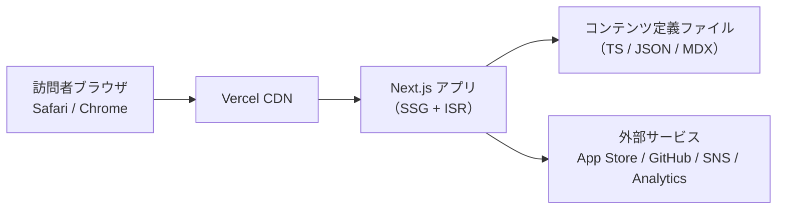

**ファイル名:** Portfolio_Requirements_v1.1.md

---

## 1. 基本情報 ✏️

| 項目         | 内容                                            |
| ---------- | --------------------------------------------- |
| プロジェクト名    | FunDriven iOS Portfolio（個人ポートフォリオサイト）         |
| ドキュメント種別   | 要件定義書 (Requirements Definition Document, RDD) |
| バージョン      | 1.1                                           |
| 作成日        | 2025-12-04                                    |
| 作成者        | ポートフォリオサイト開発チーム（＝ご本人＋協力メンバー想定）                |
| 想定プラットフォーム | Web（PC / スマートフォン、特に iOS Safari を最重要視）         |
| 関連規則ファイル   | PROJECT_CONVENTIONS.md                        |

---

## 2. 背景・目的 ✏️

### 2.1 背景

* ご本人は iOS をメインとするエンジニアで、「楽しむ」ことを軸にプロダクトを作り続けている。
* その楽しさを、アプリだけでなく「自分自身のポートフォリオサイト」でも体験してもらいたい。
* 過去の案件・自社（個人）アプリが SNS・ストア・GitHub 等に分散しており、**一箇所で魅せる場所**がない。
* 転職・副業・登壇・コミュニティ活動の際に、「この人と一緒に作ると楽しそう」が直感的に伝わるポートフォリオが必要。

### 2.2 目的

* iOS エンジニアとしての実績・技術・価値観を、**iOS アプリらしい高いデザイン性と UX**で表現する。
* 実績を「遊び心のある UI」と「詳細な技術情報」の両方から閲覧できるようにする。
* 採用担当・技術責任者が短時間でスキルを判断できる一方、一般ユーザーには「人柄と楽しさ」が伝わる構成とする。

---

## 3. ステークホルダー ✏️

| 役割           | 想定人物           | 主な関心事                    |
| ------------ | -------------- | ------------------------ |
| プロダクトオーナー    | 本人             | 自分らしさ（楽しさ）と技術力がちゃんと伝わるか  |
| デザイナー        | ご本人 or 協力デザイナー | iOS っぽい UI と遊び心のバランス     |
| フロントエンドエンジニア | ご本人 or 協力者     | 実装・保守が過度に重くならないか         |
| インフラ担当       | ご本人            | 安定・低コスト・管理のしやすさ          |
| 採用担当 / 技術責任者 | 企業側            | スキル・実績・働き方のイメージをさっと掴めるか  |
| 個人開発アプリユーザー  | 一般ユーザー         | 「この楽しいアプリの中の人は誰？」を知れるか   |
| 未来の自分        | 本人             | コンテンツ更新が苦にならないか、黒歴史化しないか |

---

## 4. スコープ ✏️

### 4.1 対象範囲（In Scope）

* 個人用ポートフォリオサイト / 自己紹介サイトの新規構築。
* 対応コンテンツ：

  * 自己紹介・価値観・経歴
  * 実績一覧（案件 / 自社アプリ / OSS 等）
  * 実績詳細（ビジネス面・技術面）
  * 技術スタックを横断して見られる「Tech Matrix」画面
  * 経歴タイムライン
  * SNS・メール等へのコンタクト導線

### 4.2 スコープ外（Out of Scope）

* EC 機能・決済。
* マルチユーザー対応（他人もアカウントを作るようなサービス化）。
* 複雑な管理画面。
* **初期リリースでの多言語対応**（v1.1 は日本語のみ。英語対応は将来拡張）。

---

## 5. 目標／KPI ✏️

### 5.1 定性的目標

* 1〜2 分で以下が伝わること：

  * どんな人か（楽しさ・スタンス）
  * 何が得意か（モバイル / iOS / UX）
  * どんな実績があるか（具体的なアプリ例）
* iOS アプリのように「触っていて気持ちいい」「もっと触りたくなる」UI であること。

### 5.2 定量的目標（初期案）

* トップページの LCP：モバイルで **2.5 秒以内**を目標。
* 月 1 件以上、ポートフォリオ経由のコンタクト（採用 / 副業 / 登壇等）。
* 実績詳細ページの平均滞在時間：60 秒以上。

---

## 6. ターゲットユーザー ✏️

（前版から構造変更なし、文言のみ微調整）

* 主ターゲット：採用担当・技術責任者・一緒に開発する可能性のあるエンジニア。
* サブ：個人開発アプリのユーザー、コミュニティ関係者。

---

## 7. システム構成 ✏️

### 7.1 技術スタック（おすすめ確定）

* フロントエンドフレームワーク：

  * **Next.js（React + TypeScript）**
  * App Router ベース、静的サイト生成（SSG）＋必要に応じて Incremental Static Regeneration。

* スタイリング / デザイン：

  * **Tailwind CSS** をベースに、独自デザインシステムを構築。
  * iOS らしいコンポーネント（カード・ボタン・セクションヘッダなど）を共通化。

* アニメーション：

  * **Framer Motion** によるページ遷移・カードホバーなどのマイクロインタラクション。

* ホスティング / CDN：

  * **Vercel** を推奨（Next.js と相性が良く、デプロイも非常に簡単）。
  * 独自ドメインを接続。

* コンテンツ管理：

  * 初期リリースでは **Git 管理の TypeScript/JSON 定義** とする（`projects.ts` / `timeline.ts` など）。
  * 更新作業：VSCode でデータ修正 → Git push → 自動デプロイ。
  * ブログ等を追加する場合は **MDX ファイルベース** を想定。
  * 将来、非エンジニアでも編集したくなった場合は microCMS / Notion 連携へ拡張可能な構造にする。

### 7.2 想定アーキテクチャ

### 7.3 環境

* 開発環境：ローカル（Next.js 開発サーバ）＋ Vercel Preview。
* 本番環境：`https://fun-driven.dev`（※推薦ドメイン。実際は空き状況を見て `https://{ハンドル名}.dev` などに調整）。
* CI/CD：

  * GitHub main ブランチへの push をトリガーに Vercel が自動ビルド・デプロイ。

---

## 8. 機能要件 ✏️

### 8.1 機能一覧（おすすめ反映済）

| ID     | 機能名               | 概要                                     | 優先度    | 備考                                 |
| ------ | ----------------- | -------------------------------------- | ------ | ---------------------------------- |
| FR-001 | ホーム／ランディング表示      | キャッチコピー・キービジュアル・主要導線を表示                | Must   | ヒーローセクション＋スクロール誘導                  |
| FR-002 | グローバルナビゲーション      | 「ホーム / 自己紹介 / 実績 / Tech / Contact」へのナビ | Must   | モバイルではボトムタブ風                       |
| FR-003 | 自己紹介セクション         | プロフィール写真・一言メッセージ・経歴概要                  | Must   | スクロールでふわっと表示                       |
| FR-004 | 価値観・コンセプト         | 「楽しむ」を中心としたストーリー表示                     | Must   | タイポグラフィ強めの構成                       |
| FR-005 | 実績一覧（カード）         | 案件・自社アプリなどをカード形式で一覧                    | Must   | タグ・年・カテゴリを表示                       |
| FR-006 | 実績詳細（概要）          | プロジェクト概要・目的・スクリーンショット                  | Must   | デバイスフレーム風表示                        |
| FR-007 | 実績詳細（技術）          | 使用技術・アーキテクチャ・担当範囲                      | Must   | コードスニペットも掲載可                       |
| FR-008 | 技術一覧（Tech Matrix） | 技術要素を横断的に一覧表示                          | Must   | 技術→実績へのリンク                         |
| FR-009 | フィルタリング・タグ        | カテゴリ / 使用技術で絞り込み                       | Should | UIはチップ型タグを想定                       |
| FR-010 | 画像ギャラリー           | 実績ごとに複数スクリーンショットのスワイプ表示                | Should | モバイルでスワイプ操作                        |
| FR-011 | 動画埋め込み            | YouTube 等のデモ動画を埋め込み                    | Could  | モーダル再生                             |
| FR-012 | 外部リンク             | App Store / GitHub / 技術記事リンク           | Must   | 新規タブで開く                            |
| FR-013 | 経歴タイムライン          | 職歴・開発歴・登壇歴などの時系列表示                     | Should | iOS のタイムライン風                       |
| FR-014 | SNS / Contact 導線  | X / GitHub / Email などへの導線              | Must   | フッター＋ヘッダの両方                        |
| FR-015 | お問い合わせフォーム        | サイト内フォームで送信                            | Could  | v1.1 では **実装しない**。メールリンクで代替        |
| FR-016 | OGP / SNS シェア     | 各ページのシェア用タイトル・画像設定                     | Should | 特にトップと代表作                          |
| FR-017 | ダークモード対応          | OS 設定 or トグルで切替                        | Should | 初期は OS 設定連動＋トグル                    |
| FR-018 | 多言語対応             | 日本語 / 英語切替                             | Could  | v1.1 では対象外（将来拡張）                   |
| FR-019 | コンテンツ更新機能         | CMS 等からの更新                             | Could  | v1.1 は Git 管理のみ。CMS連携は次フェーズ候補      |
| FR-020 | アクセス解析連携          | アクセス数などの計測                             | Should | Vercel Analytics を基本とし、必要なら GA4 追加 |

### 8.2 実績一覧・Tech Matrix の UX（補足）

* 一覧ページは「カードグリッド ＋ 上部にタグフィルタ」。
* Tech Matrix では：

  * 行：実績
  * 列：技術（Swift / SwiftUI / UIKit / Firebase / etc.）
  * 技術セルをタップすると、その技術を使った実績一覧へジャンプ。

---

## 9. 非機能要件 ✏️

| ID      | カテゴリ      | 要件内容                                                      |
| ------- | --------- | --------------------------------------------------------- |
| NFR-001 | パフォーマンス   | モバイル回線でトップページ LCP 2.5 秒以内（Next.js SSG + 画像最適化を利用）         |
| NFR-002 | パフォーマンス   | 初期ロード 1.5MB 以内を目安。画像は `next/image` で遅延読み込み。               |
| NFR-003 | レスポンシブ    | スマホファーストデザイン。PC では 2〜3 カラム展開。                             |
| NFR-004 | ブラウザ対応    | Safari / Chrome / Edge / Firefox の最新 2 バージョン。             |
| NFR-005 | 可用性       | Vercel の稼働に準拠（概ね 99% 以上）。                                 |
| NFR-006 | 保守性       | Next.js + TypeScript + Tailwind のシンプルな構成。コンポーネント分割を徹底。    |
| NFR-007 | 拡張性       | MDX / CMS 追加を見据えてコンテンツレイヤを分離。                             |
| NFR-008 | セキュリティ    | 動的機能は最小限。フォーム導入時は CSRF/XSS 対策と reCAPTCHA 相当の導入。           |
| NFR-009 | プライバシー    | Vercel Analytics を基本とし、クッキーバナーは不要な構成を優先。GA4 導入時は簡易ポリシー記載。 |
| NFR-010 | アクセシビリティ  | 文字サイズ・コントラスト・フォーカスインジケータを意識し、WCAG AA 相当を目標。               |
| NFR-011 | UX / 楽しさ  | アニメーションは 200–300ms 程度の軽いものにし、操作性を損なわない。                   |
| NFR-012 | デザイン一貫性   | Tailwind のカスタムテーマ（色・角丸・シャドウ）を定義し、全画面で統一。                  |
| NFR-013 | ロギング / 分析 | Vercel Analytics で PV / UU / 参照ページを把握。                    |
| NFR-014 | SEO       | 名前 + 「iOS エンジニア」「ポートフォリオ」で検索してヒットする構成（meta / OGP 適切設定）。   |

---

## 10. UI / UX ✏️

### 10.1 デザイン原則

* **シンプル＋余白多めの iOS 17 風**。
* グラスモーフィズムを控えめに使い、主要カードに奥行きを出す。
* 「楽しさ」を色・アイコン・マイクロコピーで表現。

### 10.2 カラーテーマ（おすすめ）

* ライトモード：

  * 背景：ほぼ白（#F9FAFB 相当）
  * メインアクセント：明るいブルー or ティール系（例：#0EA5E9 相当）
  * サブアクセント：柔らかいオレンジ（「楽しさ」のニュアンス）。

* ダークモード：

  * 背景：ダークグレー（#020617〜#111827 相当）
  * アクセントカラーはライトと共通で彩度を少し落とす。

### 10.3 ロゴ・アイコン方針

* ロゴ：

  * テキストロゴ：「FunDriven」＋お名前の頭文字などを組み合わせたワードマーク。
* アイコン：

  * iOS アプリ風の角丸スクエアに、「楽しんでいる表情」「遊び心のあるシンボル」を一つ。
  * まずはシンプルな 1 色アイコンから開始し、後から凝ったデザインに差し替え可能な前提。

### 10.4 インタラクション

* スクロール時：セクションのフェードイン＋軽いスライド。
* カードホバー：1〜2px のスケールアップ＋シャドウ強調。
* ページ遷移：上・横方向の軽いトランジション（従来の iOS ナビゲーションっぽさ）。
* ダークモード切り替え：スイッチ操作時に 150〜200ms 程度のクロスフェード。

---

## 11. データ要件 ✏️

### 11.1 データ管理方式

* 実績・タイムライン・プロフィール等は **TypeScript/JSON モジュール**として管理。

  * 例：`src/content/projects.ts` / `src/content/timeline.ts` / `src/content/profile.ts`
* ブログ導入時は `content/blog/*.mdx` のように MDX を採用。

### 11.2 実績データモデル（再掲＋微調整）

上位レベルの構造は前版と同じだが、「最低掲載件数」として **6〜8 件**を目標とする。

* 必須フィールド：title, category, shortDescription, description, role, techStack, platform, year, images（1枚以上）。
* 任意フィールド：appStoreUrl, repoUrl, articleUrls, videoUrl, tags, architecture。

---

## 12. 外部インタフェース ✏️

| 種別        | 対象               | 目的           | 実装方針                  |
| --------- | ---------------- | ------------ | --------------------- |
| Webリンク    | App Store        | アプリ紹介        | ボタン＋カード内リンク           |
| Webリンク    | GitHub           | コード・OSS      | 外部アイコン付きリンク           |
| Webリンク    | 技術ブログ            | 記事紹介         | 別タブで開く                |
| Analytics | Vercel Analytics | アクセス解析       | Vercel ダッシュボード上で確認    |
| Analytics | GA4（任意）          | 詳細解析         | 必要になったら追加実装           |
| メール       | `mailto:` リンク    | お問い合わせ       | Contact ページ / フッターに設置 |
| SNS       | X / GitHub / 他   | コンタクト・フォロー導線 | 共通コンポーネント化            |

※ お問い合わせフォームを導入する場合は、Formspree 等の外部フォームサービスを候補とする（v1.1 では未導入）。

---

## 13. 制約・前提 ✏️

* 制作・運用：基本的にご本人が主体。
* 予算：

  * ドメイン：年数千円程度（`.dev` など）。
  * Vercel：無料枠内を想定（アクセス増加時に検討）。
* 法令・プライバシー：

  * 取得する個人情報は `mailto:` 経由のメール本文程度。
  * フォーム導入時はプライバシーポリシー簡易版を用意。
* ドメイン（推奨）：

  * `https://fun-driven.dev` を第一候補とし、埋まっている場合は

    * `https://{ハンドル名}.dev`
    * `https://{ハンドル名}.me`
      などを候補とする。

---

## 14. 受入基準 ✏️

* 機能面：

  * ホーム / 自己紹介 / 実績一覧 / 実績詳細 / Tech 一覧 / Contact（メールリンク）が利用可能。
  * 最低 **6 件**の実績データが投入されている。
  * Tech 一覧から特定の技術（例：SwiftUI）を選ぶと、その技術を使った実績が確認できる。

* UX / デザイン面：

  * iPhone 実機で閲覧した際、ネイティブアプリに近い操作感とスムーズなアニメーションである。
  * 無意味なアニメーションや遷移によるストレスがない。

* 非機能面：

  * モバイル回線で初回アクセスしても、ストレスなくトップが表示される。
  * Safari / Chrome での表示崩れがない。

---

## 15. マイルストーン ✏️

| マイルストーン | 内容                            | 目安時期        |
| ------- | ----------------------------- | ----------- |
| M1      | RDD v1.1 確定                   | T0          |
| M2      | 画面遷移図・ワイヤーフレーム作成（Figma 等）     | T0 + 1〜2週間  |
| M3      | デザインモック & コンポーネント設計           | T0 + 3〜4週間  |
| M4      | Next.js + Tailwind による実装      | T0 + 4〜8週間  |
| M5      | 実績・テキストの投入、アイコン/ロゴ反映          | 開発と並行       |
| M6      | ステージング（Vercel Preview）で確認・微調整 | T0 + 8〜9週間  |
| M7      | 本番デプロイ（v1.0 プロダクトリリース）        | T0 + 10週間前後 |
| M8      | 四半期ごとのコンテンツ更新（新しい実績の追加等）      | リリース後継続     |

---

## 16. リスクと課題 ✏️

| 区分  | 内容                                  | 対応方針                            |
| --- | ----------------------------------- | ------------------------------- |
| リスク | 実績コンテンツの整理が後ろ倒しになり、デザインだけ完成して公開が遅れる | M2〜M3 の段階で実績一覧を先にテキストベースで固める    |
| リスク | デザインにこだわりすぎて実装が複雑化                  | 「必須コンポーネント」セットを固定し、そこに集中する      |
| リスク | 受託案件の守秘義務により内容が出しにくい                | 匿名化・モザイク・機能イメージ図で表現する方針を事前に決める  |
| 課題  | ロゴ・アイコンの最終デザイン                      | v1.1 ではシンプル版を使用し、後日差し替え可能な構成にする |
| 課題  | ブログや英語版をいつ追加するか                     | リリース後のアクセス状況・ニーズを見て判断           |

---

## 17. 変更履歴 ✏️

| バージョン | 日付         | 変更者             | 変更内容                                                               |
| ----- | ---------- | --------------- | ------------------------------------------------------------------ |
| 1.0   | 2025-12-04 | ポートフォリオサイト開発チーム | 初版作成                                                               |
| 1.1   | 2025-12-04 | ポートフォリオサイト開発チーム | 技術スタック / ホスティング / ドメイン方針 / コンテンツ管理 / 解析 / 問い合わせ手段など未決定事項をおすすめ方針で確定 |

---

## 18. 付録（規則ファイル） ✏️

* `PROJECT_CONVENTIONS.md`

  * コーディング規約（TypeScript / React / Tailwind）
  * コンポーネント命名規則
  * Git ブランチ戦略（例：main / develop / feature/**）
  * コミットメッセージフォーマット（例：Conventional Commits）

---

## 19. バージョン指定規則 ✏️

* 本 RDD：`Major.Minor`（例：1.0, 1.1, 2.0）。

* Major：情報設計やコンセプトが大きく変わるとき。

* Minor：機能追加や方針の確定など、後方互換性のある変更。

* プロダクト（サイト）側：Semantic Versioning 2.0.0 を採用可能とし、

  * 例：`1.0.0`（初版リリース）
  * `1.1.0`（新しいセクション追加）
  * `1.1.1`（軽微なデザイン修正）
    といった運用を想定。

* リリースごとに `CHANGELOG.md` に以下を追記：

  * リリース日
  * 実装バージョン（例：Site v1.0.0）
  * 対応する RDD バージョン（例：RDD v1.1）
  * 主な変更点

---

## TODO（未決事項）

「技術や構成」はほぼ確定したので、残りは **中身とビジュアルの作り込み** が中心です。

1. 実際に掲載する **実績リストの確定**

   * 各プロジェクトのタイトル / 年 / 役割 / 使用技術 / 画像の整理。
2. 自己紹介テキストの詳細

   * 「楽しむ」を軸にしたストーリーライティング（400〜800文字程度）。
3. キービジュアルの具体案

   * 写真ベースにするか、イラストにするか、Apple 的なシンプルさで押すか。
4. マイクロコピーの調整

   * ボタンラベル・セクションタイトル・タグ名を実際のトーンに合わせて微調整。
5. 将来の拡張計画の優先度

   * ブログ追加、英語版、CMS 化などをどのタイミングで行うかのざっくり優先順位付け。
